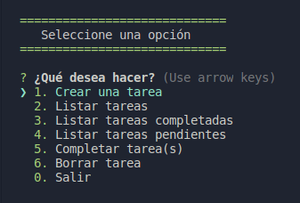

# curso-node-tareas
Segunda aplicación del [curso de Node](https://www.udemy.com/course/node-de-cero-a-experto/).

En esta aplicación se ha desarrollado un pequeño programa de consola en la que se pueden crear, listar eliminar y marcar como completadas aquellas tareas que se quieran.

Para ejecutar:

```
node app.js
```



